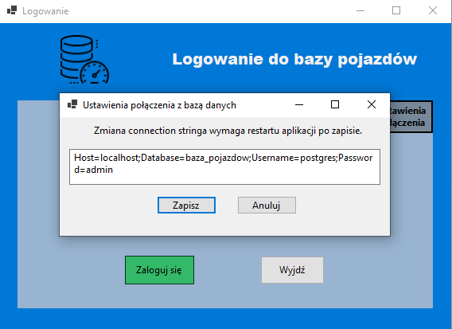
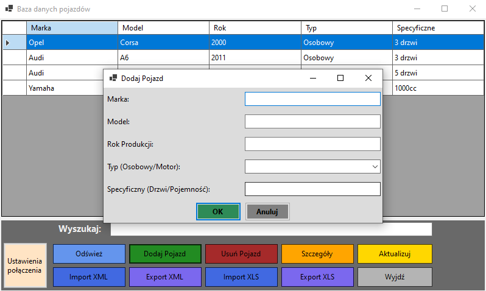
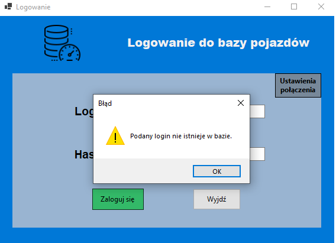
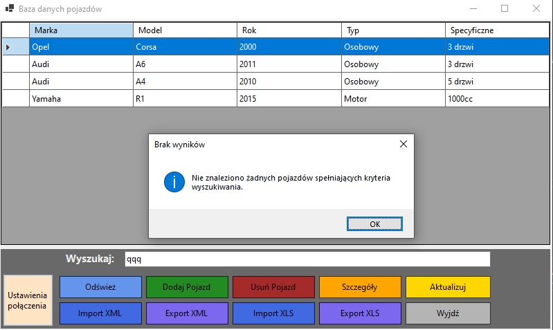
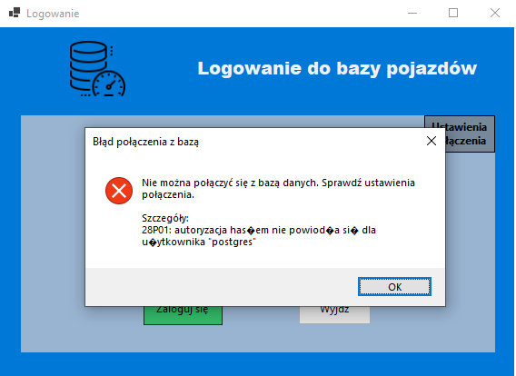

# Vehicle-database-CSharp-application

## Opis aplikacji
Aplikacja **Vehicle Database** umożliwia zarządzanie bazą pojazdów i ich szczegółami w relacyjnej bazie danych PostgreSQL. System został stworzony w języku **C#** z wykorzystaniem technologii Entity Framework Core, co zapewnia wygodne mapowanie obiektowo-relacyjne oraz wsparcie dla migracji i seedowania danych. Interfejs użytkownika pozwala na intuicyjne przeglądanie, filtrowanie i edycję rekordów.


---

## Wymagania systemowe

- .NET 8.0 (lub nowszy)
- PostgreSQL 14.0 (lub nowszy)

---

## Struktura bazy danych

Aplikacja wykorzystuje **4 tabele** powiązane relacjami:

- **User** – użytkownicy systemu
- **Pojazd** – pojazdy
- **Osobowy** – szczegóły pojazdów osobowych 
- **Motor** – szczegóły motocykli

## Konfiguracja połączenia z bazą danych

- Dane połączeniowe przechowywane są w pliku `appsettings.json`.
- Połączenie można zmienić **bezpośrednio z poziomu aplikacji** (menu Ustawienia) bez potrzeby rekompilacji.



### Przykład sekcji połączenia w `appsettings.json`:

```json
{
  "ConnectionStrings": {
    "DefaultConnection": "Host=localhost;Database=baza_pojazdow;Username=postgres;Password=admin"
  }
}
```

---

## Migracje i seedery

- Do tworzenia i aktualizacji bazy wykorzystywane są **migracje Entity Framework Core**.
- Po utworzeniu bazy, automatycznie dodawane są przykładowe dane testowe (seed).
- Aby utworzyć bazę i załadować dane, wykonaj w katalogu projektu:

```sh
dotnet ef database update
```

---

## Instrukcja uruchomienia projektu na innym komputerze

Aby uruchomić projekt na swoim komputerze, wykonaj poniższe kroki:

1. **Sklonuj repozytorium:**
   ```sh
   git clone https://github.com/kacperhalaj/Vehicle-database-CSharp-application.git
   cd Vehicle-database-CSharp-application
   ```

2. **Utwórz pustą bazę danych w PostgreSQL** (np. przez pgAdmin lub konsolę):
   ```sql
   CREATE DATABASE baza_pojazdow;
   ```
   *(Uwaga: możesz użyć innej nazwy, ale pamiętaj aby ustawić ją w connection string!)*

3. **Skonfiguruj połączenie do bazy danych**  
   - Edytuj plik `appsettings.json` (w katalogu projektu) i ustaw odpowiedni connection string do swojej bazy.
   - Lub ustaw go przez menu Ustawienia w aplikacji.

4. **Zainstaluj narzędzia .NET/EF Core (jeśli nie masz):**
   ```sh
   dotnet --version
   dotnet tool install --global dotnet-ef
   ```

5. **Zbuduj projekt:**
   ```sh
   dotnet build
   ```

6. **Wykonaj migracje i załaduj dane przykładowe:**
   ```sh
   dotnet ef database update
   ```

7. **Uruchom aplikację:**
   ```sh
   dotnet run
   ```
   lub otwórz w IDE (np. Visual Studio) i uruchom.

8. **Zaloguj się przykładowym kontem:**
   - login: `admin`
   - hasło: `admin123`

---

## Główne funkcjonalności

- Przeglądanie, filtrowanie i wyszukiwanie pojazdów (np. po marce, modelu itd.)
- Dodawanie, edycja i usuwanie pojazdów oraz powiązanych danych szczegółowych
- Eksport/import danych do/z plików XML/XLS
- Konfigurowalne połączenie z bazą w trakcie działania aplikacji

### Formularz dodawania pojazdu



### Formularz aktualizowania pojazdu


---

## Walidacja danych

- **Podstawowa**: Sprawdzanie, czy pola są wypełnione, wartości w dozwolonym zakresie (np. liczba drzwi 1–5, pojemność silnika > 0).
- **Zaawansowana**: Walidacja zależna od kontekstu (np. liczba drzwi tylko dla osobowych, pojemność tylko dla motocykli).
- Pola formularzy korzystają z odpowiednich kontrolek

### Przykład walidacji formularza



---

## Instrukcja obsługi

1. Uruchom aplikację.
2. Zaloguj się danymi użytkownika.
3. Użyj wyszukiwarki w głównym oknie, aby szybko znaleźć interesujący pojazd.
4. Dodaj nowy pojazd – wybierz typ, podaj wymagane dane (walidacja kontekstowa).
5. Edytuj lub usuń pojazd klikając odpowiedni przycisk.
6. Zmień ustawienia połączenia do bazy w menu Ustawienia, a następnie zrestartuj aplikację.
7. Opcjonalnie eksportuj/importuj dane do/z pliku XML/XLS.

---

## Przypadki brzegowe

- **Liczba drzwi musi być w zakresie 1–5** – dotyczy tylko pojazdów osobowych.
- **Pojemność silnika musi być > 0** – dotyczy tylko motocykli.
- **Usunięcie pojazdu powoduje usunięcie powiązanych rekordów (cascade delete)**.
- **Zmiana connection string w trakcie działania wymaga restartu aplikacji**.
- **Niepoprawne dane logowania uniemożliwiają dostęp do aplikacji**.
- **Filtrowanie nie znajduje wyników – użytkownik otrzymuje odpowiedni komunikat**.
  
- **Brak połączenia z bazą – aplikacja informuje o błędzie i umożliwia zmianę ustawień połączenia**.
  
  
---

## Autor

- kacperhalaj

---
